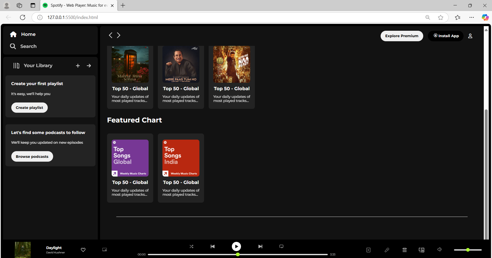

# Spotify_Clone
“This is a visual-only clone of Spotify’s website made with HTML and CSS, designed to mimic the layout and appearance of selected sections from the original site.”
## Font & Icon Substitutions:-
Since Spotify uses proprietary fonts and icons, Google Fonts were used as a close alternative for typography, and free icons from FontAwesome were used to replicate the iconography. Additionally, custom images were used in some areas to represent icons.
## Preview
**Homepage View:**

**Player Section View:**

